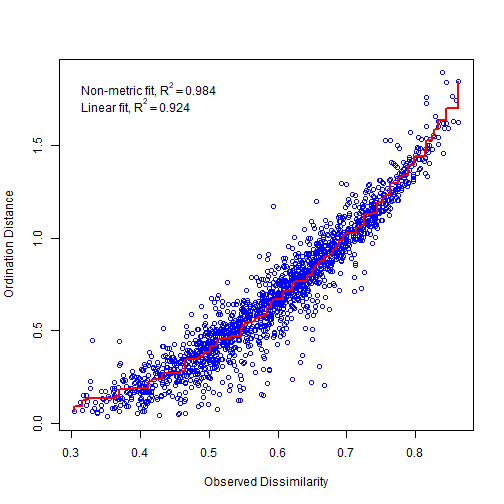

```r
otu_table = read_table2(here("data/16S/table-w-taxonomy.txt"), skip = 1)
```

```
## Warning: 1733 parsing failures.
## row col   expected     actual                                                                        file
##   8  -- 68 columns 66 columns 'G:/My Drive/UCSB/Research/tomkat_c_analysis/data/16S/table-w-taxonomy.txt'
##  15  -- 68 columns 69 columns 'G:/My Drive/UCSB/Research/tomkat_c_analysis/data/16S/table-w-taxonomy.txt'
##  31  -- 68 columns 62 columns 'G:/My Drive/UCSB/Research/tomkat_c_analysis/data/16S/table-w-taxonomy.txt'
##  37  -- 68 columns 62 columns 'G:/My Drive/UCSB/Research/tomkat_c_analysis/data/16S/table-w-taxonomy.txt'
##  38  -- 68 columns 69 columns 'G:/My Drive/UCSB/Research/tomkat_c_analysis/data/16S/table-w-taxonomy.txt'
## ... ... .......... .......... ...........................................................................
## See problems(...) for more details.
```

```r
braycurtis = read_tsv(here("data/16S/braycurtis.tsv"))
```

```
## Warning: Missing column names filled in: 'X1' [1]
```

```r
jaccard = read_tsv(here("data/16S/jaccard.tsv"))
```

```
## Warning: Missing column names filled in: 'X1' [1]
```

```r
shannon = read_tsv(here("data/16S/shannon.tsv"))
```

```
## Warning: Missing column names filled in: 'X1' [1]
```


```r
otu_straight = otu_table %>% 
  column_to_rownames("#OTU_ID") %>% 
  select(starts_with("TOKA")) %>% 
  t() %>% 
  as.data.frame() %>% 
  select_if(colSums(.) != 0)

otu_standard = decostand(otu_straight, method = "total")


otu_hellinger = decostand(otu_straight, method = "hellinger")
```


```r
phylum_key = otu_table %>% 
  select(`#OTU_ID`, p)


family_table = otu_straight %>% 
  rownames_to_column("point_id") %>% 
  pivot_longer(-point_id) %>% 
  left_join(phylum_key, by = c("name" = "#OTU_ID")) %>% 
  group_by(point_id, p) %>% 
  summarise(family_count = sum(value)) %>% 
  pivot_wider(id_cols = point_id, names_from = p, values_from = family_count)
```

```
## `summarise()` has grouped output by 'point_id'. You can override using the `.groups` argument.
```

```r
family_standard = family_table %>% 
  column_to_rownames("point_id") %>% 
  decostand(method = "total")
```


```r
bc = vegdist(otu_standard, method = "bray") %>% 
  as.matrix(labels = T)
bcns = vegdist(otu_straight)

NMS16S = otu_standard %>% 
  filter(row.names(.) != "TOKA-099-10") %>% 
  metaMDS( distance = "bray", k = 2, maxit = 999, trymax = 500, wascores = TRUE)
```

```
## Run 0 stress 0.1279303 
## Run 1 stress 0.1706619 
## Run 2 stress 0.1536593 
## Run 3 stress 0.1747581 
## Run 4 stress 0.1421919 
## Run 5 stress 0.1280475 
## ... Procrustes: rmse 0.005993431  max resid 0.0429443 
## Run 6 stress 0.1910929 
## Run 7 stress 0.4059171 
## Run 8 stress 0.142193 
## Run 9 stress 0.1279303 
## ... New best solution
## ... Procrustes: rmse 3.41499e-06  max resid 2.291509e-05 
## ... Similar to previous best
## Run 10 stress 0.1279303 
## ... Procrustes: rmse 3.719241e-05  max resid 0.0002533637 
## ... Similar to previous best
## Run 11 stress 0.1648099 
## Run 12 stress 0.1973093 
## Run 13 stress 0.1279815 
## ... Procrustes: rmse 0.00200036  max resid 0.01263909 
## Run 14 stress 0.1422837 
## Run 15 stress 0.1540167 
## Run 16 stress 0.1422837 
## Run 17 stress 0.1421919 
## Run 18 stress 0.142192 
## Run 19 stress 0.1706621 
## Run 20 stress 0.1696 
## *** Solution reached
```

```r
NMS_family = family_standard %>% 
  filter(row.names(.) != "TOKA-099-10") %>% 
  metaMDS(distance = "bray", k = 2, maxit = 999, trymax = 500, wascores = TRUE)
```

```
## Run 0 stress 0.1006103 
## Run 1 stress 0.1238377 
## Run 2 stress 0.1215305 
## Run 3 stress 0.1112732 
## Run 4 stress 0.100607 
## ... New best solution
## ... Procrustes: rmse 0.001064721  max resid 0.006582379 
## ... Similar to previous best
## Run 5 stress 0.1269008 
## Run 6 stress 0.1235979 
## Run 7 stress 0.1400609 
## Run 8 stress 0.1215305 
## Run 9 stress 0.1451368 
## Run 10 stress 0.1255702 
## Run 11 stress 0.1014461 
## Run 12 stress 0.1006103 
## ... Procrustes: rmse 0.001064723  max resid 0.006582437 
## ... Similar to previous best
## Run 13 stress 0.1130898 
## Run 14 stress 0.1332853 
## Run 15 stress 0.1143255 
## Run 16 stress 0.1221966 
## Run 17 stress 0.1009233 
## ... Procrustes: rmse 0.02225484  max resid 0.1182361 
## Run 18 stress 0.1112732 
## Run 19 stress 0.133616 
## Run 20 stress 0.1352759 
## *** Solution reached
```


```r
stressplot(NMS16S)
```




```r
otu_scores = scores(NMS16S) %>% 
  as.data.frame() %>% 
  rownames_to_column("point_id")

family_scores = scores(NMS_family) %>% 
  as.data.frame() %>% 
  rownames_to_column("point_id")
```


```r
# rda.fam = family_standard %>% 
#   filter(row.names(.) != "TOKA-099-10") %>% 
#   rda()
# fam_scores = scores(rda.fam, display = "sites", choices = c(1,2,3,4)) %>% 
#   as.data.frame() %>% 
#   rownames_to_column("point_id")
# 
# rda.otu = rda(otu_standard)
# otu_scores = scores(rda.otu, display = "sites", choices = c(1,2,3,4)) %>% 
#   as.data.frame() %>% 
#   rownames_to_column("point_id")
```


```r
# 
# ggplot(fam_scores, aes(x = PC1, y = PC2)) +
#   geom_point()
# 
# ggplot(otu_scores, aes(x = PC2, y = PC3)) +
#   geom_point()
```

