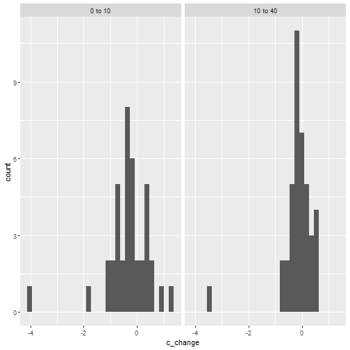
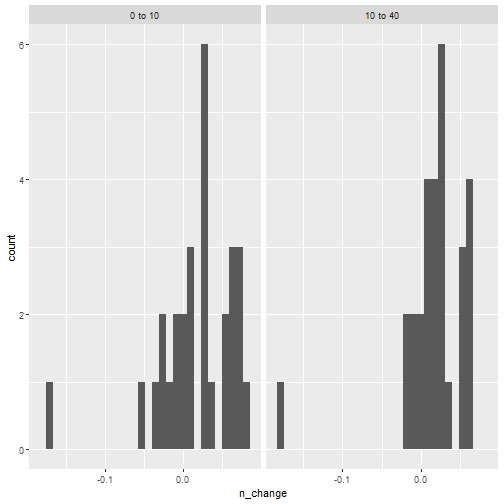
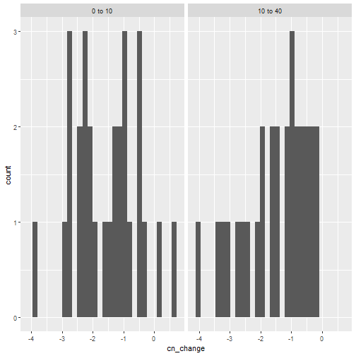
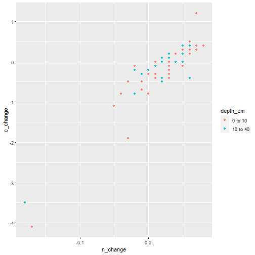
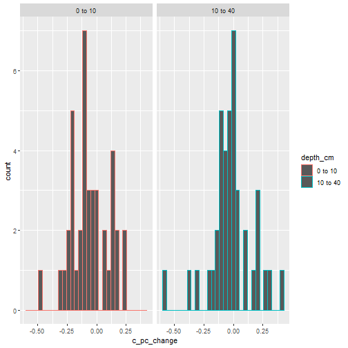
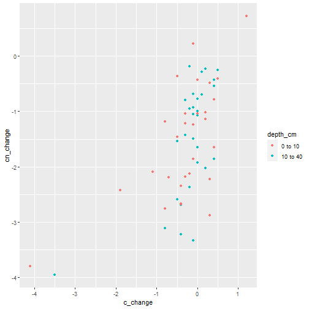

Read in the data


```r
data_nut = tibble(files = list.files(here("data/soil"))) %>%
  mutate(data = map(files, ~ read_csv(here(paste("data/soil/"), .x), 
                                      col_types = cols(`Olsen P` = col_character(),
                                                       `Sodium` = col_double(),
                                                       `Total Nitrogen` = col_double(),
                                                       `pH` = col_double(),
                                                       `Sand` = col_double(),
                                                       `Silt` = col_double(),
                                                       `Clay` = col_double()
                                                       )
                                      )
                    )
         )  
```

```
## Warning: Problem with `mutate()` input `data`.
## i 3 parsing failures.
## row  col expected actual                                                                                        file
##  25 Sand a double    QNS 'G:/My Drive/UCSB/Research/tomkat_c_analysis/data/soil//TOKA_RMNData_ 2015_RMN_10-40cm.csv'
##  25 Silt a double    QNS 'G:/My Drive/UCSB/Research/tomkat_c_analysis/data/soil//TOKA_RMNData_ 2015_RMN_10-40cm.csv'
##  25 Clay a double    QNS 'G:/My Drive/UCSB/Research/tomkat_c_analysis/data/soil//TOKA_RMNData_ 2015_RMN_10-40cm.csv'
## 
## i Input `data` is `map(...)`.
```

```
## Warning: Problem with `mutate()` input `data`.
## i Duplicated column names deduplicated: 'Water Infiltration (T2)' => 'Water Infiltration (T2)_1' [6]
## i Input `data` is `map(...)`.
```

```
## Warning: Problem with `mutate()` input `data`.
## i 13 parsing failures.
## row            col expected  actual                                                                                      file
##  11 Total Nitrogen a double QNS     'G:/My Drive/UCSB/Research/tomkat_c_analysis/data/soil//TOKA_RMNData_2015_RMN_0-10cm.csv'
##  14 Sand           a double QNS     'G:/My Drive/UCSB/Research/tomkat_c_analysis/data/soil//TOKA_RMNData_2015_RMN_0-10cm.csv'
##  14 Silt           a double QNS     'G:/My Drive/UCSB/Research/tomkat_c_analysis/data/soil//TOKA_RMNData_2015_RMN_0-10cm.csv'
##  14 Clay           a double QNS     'G:/My Drive/UCSB/Research/tomkat_c_analysis/data/soil//TOKA_RMNData_2015_RMN_0-10cm.csv'
##  19 Sodium         a double < 0.090 'G:/My Drive/UCSB/Research/tomkat_c_analysis/data/soil//TOKA_RMNData_2015_RMN_0-10cm.csv'
## ... .............. ........ ....... .........................................................................................
## See problems(...) for more details.
## 
## i Input `data` is `map(...)`.
```

```
## Warning: Problem with `mutate()` input `data`.
## i Duplicated column names deduplicated: 'Water Infiltration (T2)' => 'Water Infiltration (T2)_1' [7]
## i Input `data` is `map(...)`.
```

```
## Warning: Problem with `mutate()` input `data`.
## i The following named parsers don't match the column names: Total Nitrogen
## i Input `data` is `map(...)`.
```

```
## Warning: Problem with `mutate()` input `data`.
## i 10 parsing failures.
## row col expected    actual                                                                                      file
##   1  pH a double NA: Scrub 'G:/My Drive/UCSB/Research/tomkat_c_analysis/data/soil//TOKA_RMNData_2018_RMN_0-10cm.csv'
##   7  pH a double NA: Scrub 'G:/My Drive/UCSB/Research/tomkat_c_analysis/data/soil//TOKA_RMNData_2018_RMN_0-10cm.csv'
##  12  pH a double NA: Scrub 'G:/My Drive/UCSB/Research/tomkat_c_analysis/data/soil//TOKA_RMNData_2018_RMN_0-10cm.csv'
##  14  pH a double NA: Scrub 'G:/My Drive/UCSB/Research/tomkat_c_analysis/data/soil//TOKA_RMNData_2018_RMN_0-10cm.csv'
##  22  pH a double NA: Scrub 'G:/My Drive/UCSB/Research/tomkat_c_analysis/data/soil//TOKA_RMNData_2018_RMN_0-10cm.csv'
## ... ... ........ ......... .........................................................................................
## See problems(...) for more details.
## 
## i Input `data` is `map(...)`.
```

```
## Warning: Problem with `mutate()` input `data`.
## i The following named parsers don't match the column names: Total Nitrogen
## i Input `data` is `map(...)`.
```

```
## Warning: Problem with `mutate()` input `data`.
## i 10 parsing failures.
## row col expected    actual                                                                                       file
##   1  pH a double NA: Scrub 'G:/My Drive/UCSB/Research/tomkat_c_analysis/data/soil//TOKA_RMNData_2018_RMN_10-40cm.csv'
##   7  pH a double NA: Scrub 'G:/My Drive/UCSB/Research/tomkat_c_analysis/data/soil//TOKA_RMNData_2018_RMN_10-40cm.csv'
##  12  pH a double NA: Scrub 'G:/My Drive/UCSB/Research/tomkat_c_analysis/data/soil//TOKA_RMNData_2018_RMN_10-40cm.csv'
##  14  pH a double NA: Scrub 'G:/My Drive/UCSB/Research/tomkat_c_analysis/data/soil//TOKA_RMNData_2018_RMN_10-40cm.csv'
##  22  pH a double NA: Scrub 'G:/My Drive/UCSB/Research/tomkat_c_analysis/data/soil//TOKA_RMNData_2018_RMN_10-40cm.csv'
## ... ... ........ ......... ..........................................................................................
## See problems(...) for more details.
## 
## i Input `data` is `map(...)`.
```

```
## Warning: Problem with `mutate()` input `data`.
## i The following named parsers don't match the column names: Olsen P, Sodium, Total Nitrogen, pH, Sand, Silt, Clay
## i Input `data` is `map(...)`.
```

```r
data_rmn_raw = read_csv(here("data/soil/toka_soil_surveys.csv"))
```

```
## 
## -- Column specification -------------------------------------------------------------------------------------------------------------------------
## cols(
##   .default = col_double(),
##   Project = col_character(),
##   `Study Area` = col_character(),
##   `Transect Name` = col_character(),
##   `Point Name` = col_character(),
##   Protocol = col_character(),
##   Date = col_date(format = ""),
##   `Start Time` = col_logical(),
##   `End Time` = col_logical(),
##   `Catenal Position` = col_character(),
##   `Water Infiltration Time 1` = col_time(format = ""),
##   `Water Infiltration Time 2` = col_time(format = ""),
##   `Water Infiltration Time 3` = col_time(format = ""),
##   `Water Infiltration Time 4` = col_logical(),
##   Researcher = col_character(),
##   `Other Observers Names` = col_logical(),
##   `Event Remarks` = col_character(),
##   `Observation Remarks` = col_character(),
##   Status = col_character()
## )
## i Use `spec()` for the full column specifications.
```


```r
soil_grouped = data_rmn_raw %>% 
  janitor::clean_names() %>% 
  group_by(point_name, date) %>% 
  select(transect_name, point_name, date, sample_number, carbon_0_10_cm, carbon_10_40_cm, clay_10_40_cm, silt_10_40_cm, sand_10_40_cm, grazed_this_year, bare_ground, litter_depth, catenal_position, starts_with("bulk"), max_depth) %>% 
  nest()

soil_visits = soil_grouped %>% 
  ungroup() %>% 
  group_by(point_name) %>% 
  mutate(visit = row_number()) %>% 
  filter(n() == 3)

visits_c = soil_visits %>% 
  mutate(carbon_0_10 = map_dbl(data, ~ median(.x$carbon_0_10_cm)),
         carbon_10_40 = map_dbl(data, ~ median(.x$carbon_10_40_cm)),
         clay = map_dbl(data, ~ median(.x$clay_10_40_cm)),
         c_change_10 = c(NA, diff(carbon_0_10)),
         c_change_40 = c(NA, diff(carbon_10_40))) %>% 
  ungroup()


points_c_surface = visits_c %>% 
  group_by(point_name) %>% 
  mutate(year = lubridate::year(date)) %>% 
  pivot_wider(id_cols = point_name, names_from = year, values_from = carbon_0_10) %>% 
  mutate(change18 = (`2018`- `2015`),
         change21 = `2021`- `2018`,
         depth = 10,
         id = paste(point_name, depth, sep = "-"))


points_c_depth = visits_c %>% 
  group_by(point_name) %>% 
  mutate(year = lubridate::year(date)) %>% 
  pivot_wider(id_cols = point_name, names_from = year, values_from = carbon_0_10) %>% 
  mutate(change18 = `2018`- `2015`,
         change21 = `2021`- `2018`,
         depth = 40,
         id = paste(point_name, depth, sep = "-"))

toka_c_points = bind_rows(points_c_surface, points_c_depth) %>% 
  column_to_rownames("id")
```


```r
all_data = data_nut %>% 
  unnest(data) %>%
  janitor::clean_names() %>% 
  mutate(collect_date = lubridate::dmy(collect_date),
         collect_date1 = lubridate::mdy(collect_date_1_rmn_metrics),
         date = case_when(!is.na(collect_date) ~ collect_date,
                          !is.na(collect_date1) ~ collect_date1
                          ),
         year = lubridate::year(date)
  ) %>% 
  filter(!is.na(date)) %>% 
  select(files, depth_cm, year, point_id, date, olsen_p, sand, silt, clay, texture, p_h, cec, calcium, magnesium, potassium, sodium, total_org_carbon, total_nitrogen, total_nitrogen_2)
```


```r
d = all_data %>% 
  nest(-files, -depth_cm, -year) %>% 
  select(-files) %>% 
  pivot_wider(id_cols = depth_cm, names_from = year, values_from = data) %>% 
  mutate(`2015` = map2(`2015`, `2018`, ~ .x %>% 
                         filter(point_id %in% .y$point_id) %>% 
                         rename(nitrogen = total_nitrogen) %>% 
                         mutate(cn = total_org_carbon/nitrogen)),
         `2018` = map2(`2018`, `2015`, ~ .x %>% 
                         filter(point_id %in% .y$point_id) %>% 
                         rename(nitrogen = total_nitrogen_2)%>% 
                         mutate(cn = total_org_carbon/nitrogen))
         ) %>% 
  mutate(change = map2(`2018`, `2015`, ~ .x %>% 
                         select(point_id, sand, silt, clay) %>% 
                         mutate(c_change = .x$total_org_carbon - .y$total_org_carbon,
                                c_pc_change = (.x$total_org_carbon - .y$total_org_carbon)/.y$total_org_carbon,
                                n_change = .x$nitrogen - .y$nitrogen,
                                cn_change = .x$cn - .y$cn,
                                c_2018 = .x$total_org_carbon,
                                n_2018 = .x$nitrogen,
                                c_n_ratio = c_2018/n_2018)))
```

```
## Warning: All elements of `...` must be named.
## Did you want `data = c(point_id, date, olsen_p, sand, silt, clay, texture, p_h, cec, 
##     calcium, magnesium, potassium, sodium, total_org_carbon, 
##     total_nitrogen, total_nitrogen_2)`?
```

```r
change = d %>% 
  select(depth_cm, change) %>% 
  unnest(change)

ggplot(change, aes(x = c_change)) +
  geom_histogram() +
  facet_wrap(.~ depth_cm)
```

```
## `stat_bin()` using `bins = 30`. Pick better value with `binwidth`.
```



```r
ggplot(change, aes(x = n_change)) +
  geom_histogram() +
  facet_wrap(.~ depth_cm)
```

```
## `stat_bin()` using `bins = 30`. Pick better value with `binwidth`.
```

```
## Warning: Removed 22 rows containing non-finite values (stat_bin).
```



```r
ggplot(change, aes(x = cn_change)) +
  geom_histogram() +
  facet_wrap(.~ depth_cm)
```

```
## `stat_bin()` using `bins = 30`. Pick better value with `binwidth`.
```

```
## Warning: Removed 22 rows containing non-finite values (stat_bin).
```



```r
ggplot(change, aes(x = n_change, y = c_change, color = depth_cm)) +
  geom_point()
```

```
## Warning: Removed 22 rows containing missing values (geom_point).
```



```r
ggplot(change, aes(x = c_pc_change, color = depth_cm)) +
  geom_histogram()+
  facet_wrap(.~ depth_cm)
```

```
## `stat_bin()` using `bins = 30`. Pick better value with `binwidth`.
```



```r
ggplot(change, aes(x = c_change, y = cn_change, color = depth_cm)) +
  geom_point()
```

```
## Warning: Removed 22 rows containing missing values (geom_point).
```




```r
m = lm(c_change ~ n_change, data = change)
summary(m)
```

```
## 
## Call:
## lm(formula = c_change ~ n_change, data = change)
## 
## Residuals:
##      Min       1Q   Median       3Q      Max 
## -0.91484 -0.18474  0.02521  0.21186  0.72739 
## 
## Coefficients:
##             Estimate Std. Error t value Pr(>|t|)    
## (Intercept) -0.51186    0.04664  -10.98 1.41e-15 ***
## n_change    15.77670    0.93626   16.85  < 2e-16 ***
## ---
## Signif. codes:  0 '***' 0.001 '**' 0.01 '*' 0.05 '.' 0.1 ' ' 1
## 
## Residual standard error: 0.3354 on 56 degrees of freedom
##   (22 observations deleted due to missingness)
## Multiple R-squared:  0.8353,	Adjusted R-squared:  0.8323 
## F-statistic: 283.9 on 1 and 56 DF,  p-value: < 2.2e-16
```

