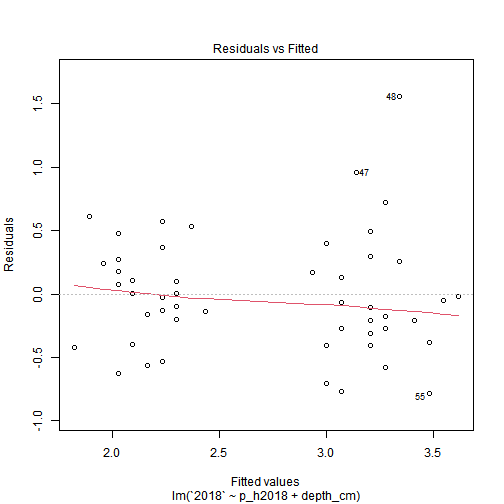
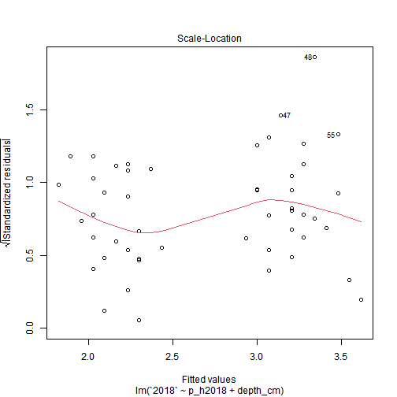

Read in the data


```r
data_nut = tibble(files = list.files(here("data/soil"))) %>%
  mutate(data = map(files, ~ read_csv(here(paste("data/soil/"), .x), 
                                      col_types = cols(`Olsen P` = col_character(),
                                                       `Sodium` = col_double(),
                                                       `Total Nitrogen` = col_double(),
                                                       `pH` = col_double(),
                                                       `Sand` = col_double(),
                                                       `Silt` = col_double(),
                                                       `Clay` = col_double()
                                                       )
                                      )
                    )
         )  
```

```
## New names:
## * `Water Infiltration (T2)` -> `Water Infiltration (T2)...5`
## * `Water Infiltration (T2)` -> `Water Infiltration (T2)...6`
```

```
## New names:
## * `Water Infiltration (T2)` -> `Water Infiltration (T2)...6`
## * `Water Infiltration (T2)` -> `Water Infiltration (T2)...7`
```

```
## Warning: The following named parsers don't match the column names: Total Nitrogen

## Warning: The following named parsers don't match the column names: Total Nitrogen
```

```
## Warning: The following named parsers don't match the column names: Olsen P, Sodium, Total Nitrogen, pH, Sand, Silt, Clay
```

```r
data_rmn_raw = read_csv(here("data/soil/toka_soil_surveys.csv"))
```

```
## Rows: 490 Columns: 43
```

```
## -- Column specification --------------------------------------------------------------------------------------------------------------------
## Delimiter: ","
## chr  (10): Project, Study Area, Transect Name, Point Name, Protocol, Catenal Position, Researcher, Event Remarks, Observation Remarks, S...
## dbl  (25): Sample Number, Sample Distance, Sample Bearing, Ring Infiltrometer Diameter, Water Volume, Bulk Density Diameter, Bulk Densit...
## lgl   (4): Start Time, End Time, Water Infiltration Time 4, Other Observers Names
## date  (1): Date
## time  (3): Water Infiltration Time 1, Water Infiltration Time 2, Water Infiltration Time 3
```

```
## 
## i Use `spec()` to retrieve the full column specification for this data.
## i Specify the column types or set `show_col_types = FALSE` to quiet this message.
```


```r
soil_grouped = data_rmn_raw %>% 
  janitor::clean_names() %>% 
  group_by(point_name, date) %>% 
  select(transect_name, point_name, date, sample_number, carbon_0_10_cm, carbon_10_40_cm, clay_10_40_cm, silt_10_40_cm, sand_10_40_cm, grazed_this_year, bare_ground, litter_depth, catenal_position, starts_with("bulk"), max_depth) %>% 
  nest()

soil_visits = soil_grouped %>% 
  ungroup() %>% 
  group_by(point_name) %>% 
  mutate(visit = row_number()) 
# 
# %>% 
#   filter(n() == 3)

visits_c = soil_visits %>% 
  mutate(carbon_0_10 = map_dbl(data, ~ median(.x$carbon_0_10_cm)),
         carbon_10_40 = map_dbl(data, ~ median(.x$carbon_10_40_cm)),
         clay = map_dbl(data, ~ median(.x$clay_10_40_cm)),
         c_change_10 = c(NA, diff(carbon_0_10)),
         c_change_40 = c(NA, diff(carbon_10_40))) %>% 
  ungroup()


points_c_surface = visits_c %>% 
  group_by(point_name) %>% 
  mutate(year = lubridate::year(date)) %>% 
  pivot_wider(id_cols = point_name, names_from = year, values_from = carbon_0_10) %>% 
  mutate(change18 = case_when(!is.na(`2015`) ~ `2018`- `2015`,
                              is.na(`2015`) ~ `2018`- `2014`),
         change21 = `2021`- `2018`,
         depth = 10,
         id = paste(point_name, depth, sep = "-"))


points_c_depth = visits_c %>% 
  group_by(point_name) %>% 
  mutate(year = lubridate::year(date)) %>% 
  pivot_wider(id_cols = point_name, names_from = year, values_from = carbon_10_40) %>% 
  mutate(change18 = case_when(!is.na(`2015`) ~ `2018`- `2015`,
                              is.na(`2015`) ~ `2018`- `2014`),
         change21 = `2021`- `2018`,
         depth = 40,
         id = paste(point_name, depth, sep = "-"))

toka_c_points = bind_rows(points_c_surface, points_c_depth) %>% 
  column_to_rownames("id")
```


```r
all_data = data_nut %>% 
  unnest(data) %>%
  janitor::clean_names() %>% 
  mutate(collect_date = lubridate::dmy(collect_date),
         collect_date1 = lubridate::mdy(collect_date_1_rmn_metrics),
         date = case_when(!is.na(collect_date) ~ collect_date,
                          !is.na(collect_date1) ~ collect_date1
                          ),
         year = lubridate::year(date)
  ) %>% 
  filter(!is.na(date)) %>% 
  select(files, depth_cm, year, point_id, date, olsen_p, sand, silt, clay, texture, p_h, cec, calcium, magnesium, potassium, sodium, total_org_carbon, total_nitrogen, total_nitrogen_2)
```

```
## Warning: One or more parsing issues, see `problems()` for details

## Warning: One or more parsing issues, see `problems()` for details

## Warning: One or more parsing issues, see `problems()` for details

## Warning: One or more parsing issues, see `problems()` for details
```


```r
d = all_data %>% 
  nest(-files, -depth_cm, -year) %>% 
  select(-files) %>% 
  pivot_wider(id_cols = depth_cm, names_from = year, values_from = data) %>% 
  mutate(`2015` = map2(`2015`, `2018`, ~ .x %>% 
                         filter(point_id %in% .y$point_id) %>% 
                         rename(nitrogen = total_nitrogen) %>% 
                         mutate(cn = total_org_carbon/nitrogen)),
         `2018` = map2(`2018`, `2015`, ~ .x %>% 
                         filter(point_id %in% .y$point_id) %>% 
                         rename(nitrogen = total_nitrogen_2)%>% 
                         mutate(cn = total_org_carbon/nitrogen))
         ) %>% 
  mutate(change = map2(`2018`, `2015`, ~ .x %>% 
                         full_join(.y, by = c("point_id"), suffix = c("2018", "2015")) %>% 
                         select(contains(c("point_id", "sand", "silt", "clay", "total_org", "nitrogen", "cn", "p_h"))) %>% 
                          mutate(c_change = total_org_carbon2018 - total_org_carbon2015,
                                c_pc_change = c_change/total_org_carbon2015,
                                n_change = nitrogen2018 - nitrogen2015,
                                cn_change = cn2018 - cn2015,
                                c_2018 = total_org_carbon2018,
                                n_2018 = nitrogen2018,
                                c_n_ratio = c_2018/n_2018,
                                sand = sand2018,
                                silt = silt2018,
                                clay = clay2018,
                                p_h_change = p_h2018 - p_h2015
                                ) %>% 
                         select(point_id, n_change, n_2018, sand, silt, clay, contains("nitrogen"), contains("p_h")) 
                         )
         )
```

```
## Warning: All elements of `...` must be named.
## Did you want `data = c(point_id, date, olsen_p, sand, silt, clay, texture, p_h, cec, 
##     calcium, magnesium, potassium, sodium, total_org_carbon, 
##     total_nitrogen, total_nitrogen_2)`?
```

```r
                         # 
                         # mutate(c_change = .x$total_org_carbon - .y$total_org_carbon,
                         #        c_pc_change = (.x$total_org_carbon - .y$total_org_carbon)/.y$total_org_carbon,
                         #        n_change = .x$nitrogen - .y$nitrogen,
                         #        cn_change = .x$cn - .y$cn,
                         #        c_2018 = .x$total_org_carbon,
                         #        n_2018 = .x$nitrogen,
                         #        c_n_ratio = c_2018/n_2018)))
```

```r
change = d %>% 
  select(depth_cm, change) %>% 
  unnest(change) %>% 
  mutate(depth = case_when(depth_cm == "0 to 10" ~ 10,
                           depth_cm == "10 to 40" ~ 40)) %>% 
  left_join(toka_c_points, by = c("point_id" = "point_name", "depth")) %>% 
  mutate(c_n_ratio = `2018`/n_2018,
         c_n_15 = `2015`/nitrogen2015,
         cn_change = c_n_ratio - c_n_15)
# 
# ggplot(change, aes(x = c_change)) +
#   geom_histogram() +
#   facet_wrap(.~ depth_cm)
# 
# ggplot(change, aes(x = n_change)) +
#   geom_histogram() +
#   facet_wrap(.~ depth_cm)
# 
# ggplot(change, aes(x = cn_change)) +
#   geom_histogram() +
#   facet_wrap(.~ depth_cm)
# 
# ggplot(change, aes(x = n_change, y = c_change, color = depth_cm)) +
#   geom_point()
# 
# ggplot(change, aes(x = c_pc_change, color = depth_cm)) +
#   geom_histogram()+
#   facet_wrap(.~ depth_cm)
# 
# ggplot(change, aes(x = c_change, y = cn_change, color = depth_cm)) +
#   geom_point()
```


```r
change10 = change %>% 
  filter(depth_cm == "0 to 10")

change40 = change %>% 
  filter(depth_cm == "10 to 40")
summary(change40)
```

```
##    depth_cm           point_id            n_change           n_2018            sand            silt           clay       total_nitrogen
##  Length:40          Length:40          Min.   :-0.1800   Min.   :0.1400   Min.   :15.00   Min.   :16.2   Min.   :17.50   Min.   : NA   
##  Class :character   Class :character   1st Qu.: 0.0100   1st Qu.:0.2100   1st Qu.:22.50   1st Qu.:30.9   1st Qu.:30.90   1st Qu.: NA   
##  Mode  :character   Mode  :character   Median : 0.0200   Median :0.2300   Median :28.80   Median :36.2   Median :33.80   Median : NA   
##                                        Mean   : 0.0169   Mean   :0.2486   Mean   :32.01   Mean   :34.8   Mean   :33.17   Mean   :NaN   
##                                        3rd Qu.: 0.0400   3rd Qu.:0.2700   3rd Qu.:36.52   3rd Qu.:40.0   3rd Qu.:36.52   3rd Qu.: NA   
##                                        Max.   : 0.0600   Max.   :0.5100   Max.   :60.00   Max.   :45.0   Max.   :53.80   Max.   : NA   
##                                        NA's   :11        NA's   :11                                                      NA's   :40    
##   nitrogen2018     nitrogen2015    total_nitrogen_2    p_h2018         p_h2015        p_h_change          depth         2015    
##  Min.   :0.1400   Min.   :0.1200   Min.   : NA      Min.   :5.100   Min.   :5.000   Min.   :-1.0000   Min.   :40   Min.   :1.4  
##  1st Qu.:0.2100   1st Qu.:0.1900   1st Qu.: NA      1st Qu.:5.800   1st Qu.:5.375   1st Qu.: 0.4000   1st Qu.:40   1st Qu.:2.0  
##  Median :0.2300   Median :0.2200   Median : NA      Median :6.000   Median :5.600   Median : 0.6000   Median :40   Median :2.2  
##  Mean   :0.2486   Mean   :0.2238   Mean   :NaN      Mean   :5.941   Mean   :5.555   Mean   : 0.4552   Mean   :40   Mean   :2.4  
##  3rd Qu.:0.2700   3rd Qu.:0.2500   3rd Qu.: NA      3rd Qu.:6.100   3rd Qu.:5.700   3rd Qu.: 0.6000   3rd Qu.:40   3rd Qu.:2.5  
##  Max.   :0.5100   Max.   :0.4800   Max.   : NA      Max.   :6.400   Max.   :6.300   Max.   : 0.9000   Max.   :40   Max.   :5.9  
##  NA's   :11                        NA's   :40       NA's   :11                      NA's   :11                     NA's   :4    
##       2018            2021            2014          change18          change21          c_n_ratio          c_n_15         cn_change      
##  Min.   :1.400   Min.   :1.300   Min.   :1.700   Min.   :-0.8000   Min.   :-0.30000   Min.   : 7.368   Min.   : 7.917   Min.   :-3.3333  
##  1st Qu.:2.075   1st Qu.:2.000   1st Qu.:1.775   1st Qu.:-0.2250   1st Qu.:-0.10000   1st Qu.: 8.400   1st Qu.: 9.579   1st Qu.:-1.7872  
##  Median :2.200   Median :2.200   Median :2.250   Median :-0.1000   Median : 0.10000   Median : 9.333   Median :10.417   Median :-0.9947  
##  Mean   :2.335   Mean   :2.167   Mean   :2.275   Mean   :-0.0525   Mean   : 0.04667   Mean   : 9.675   Mean   :10.536   Mean   :-0.9593  
##  3rd Qu.:2.425   3rd Qu.:2.450   3rd Qu.:2.750   3rd Qu.: 0.1250   3rd Qu.: 0.15000   3rd Qu.:10.000   3rd Qu.:11.271   3rd Qu.:-0.6111  
##  Max.   :5.300   Max.   :2.700   Max.   :2.900   Max.   : 0.6000   Max.   : 0.40000   Max.   :23.043   Max.   :14.390   Max.   : 8.6532  
##                  NA's   :25      NA's   :36                        NA's   :25         NA's   :11       NA's   :4        NA's   :13
```


```r
p_h = lm(`2018` ~ p_h2018 + depth_cm, data = change %>% filter(`2018` < 5))
summary(p_h)
```

```
## 
## Call:
## lm(formula = `2018` ~ p_h2018 + depth_cm, data = change %>% filter(`2018` < 
##     5))
## 
## Residuals:
##      Min       1Q   Median       3Q      Max 
## -0.78008 -0.27394 -0.05932  0.25313  1.55653 
## 
## Coefficients:
##                  Estimate Std. Error t value Pr(>|t|)    
## (Intercept)       -0.8913     1.6289  -0.547   0.5866    
## p_h2018            0.6830     0.2696   2.534   0.0144 *  
## depth_cm10 to 40  -1.0449     0.1263  -8.270 5.51e-11 ***
## ---
## Signif. codes:  0 '***' 0.001 '**' 0.01 '*' 0.05 '.' 0.1 ' ' 1
## 
## Residual standard error: 0.4618 on 51 degrees of freedom
##   (20 observations deleted due to missingness)
## Multiple R-squared:  0.6106,	Adjusted R-squared:  0.5953 
## F-statistic: 39.98 on 2 and 51 DF,  p-value: 3.596e-11
```

```r
plot(p_h)
```



```r
ggplot(change, aes(x = sand, y = `2018`, color = depth_cm)) +
  geom_point() +
  geom_smooth(method = "lm")
```

```
## `geom_smooth()` using formula 'y ~ x'
```

```
## Warning: Removed 40 rows containing non-finite values (stat_smooth).
```

```
## Warning: Removed 40 rows containing missing values (geom_point).
```


```r
claymod = lm(`2018` ~ clay*depth, data = change)
summary(claymod)
```

```
## 
## Call:
## lm(formula = `2018` ~ clay * depth, data = change)
## 
## Residuals:
##     Min      1Q  Median      3Q     Max 
## -0.9064 -0.3442 -0.1927  0.1042  3.0474 
## 
## Coefficients: (2 not defined because of singularities)
##             Estimate Std. Error t value Pr(>|t|)   
## (Intercept)  1.85287    0.62260   2.976  0.00506 **
## clay         0.01453    0.01837   0.791  0.43380   
## depth             NA         NA      NA       NA   
## clay:depth        NA         NA      NA       NA   
## ---
## Signif. codes:  0 '***' 0.001 '**' 0.01 '*' 0.05 '.' 0.1 ' ' 1
## 
## Residual standard error: 0.805 on 38 degrees of freedom
##   (40 observations deleted due to missingness)
## Multiple R-squared:  0.0162,	Adjusted R-squared:  -0.009687 
## F-statistic: 0.6258 on 1 and 38 DF,  p-value: 0.4338
```


