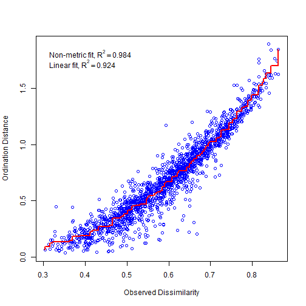
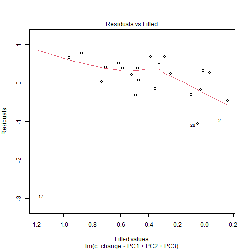
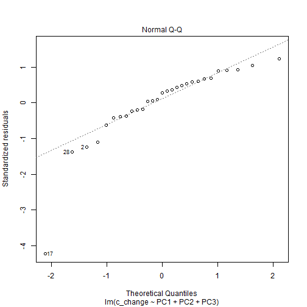
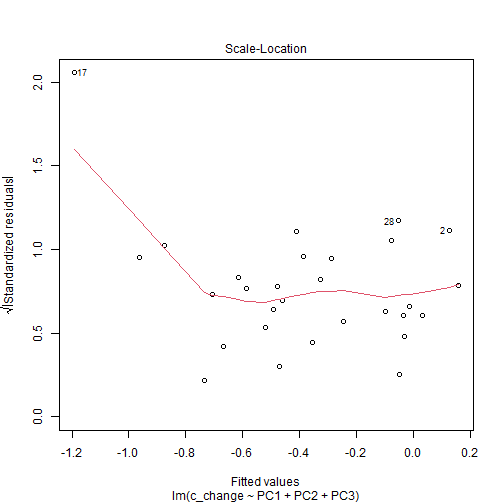
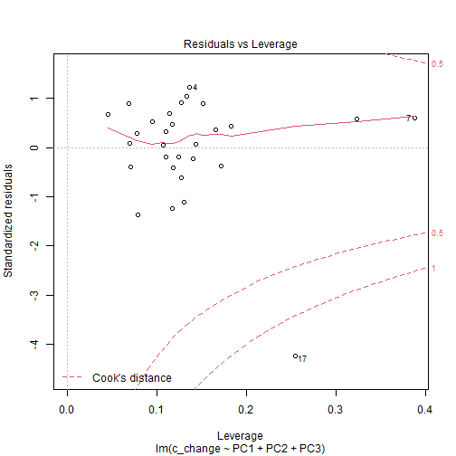

Read in data    

```r
veg = read_csv(here("data/veg/TOKA_RMNData_2018_RMN_Plants.csv"), skip = 3, col_types = cols(`Annual Forb` = col_double())) %>% 
  janitor::clean_names() %>% 
  drop_na(annual_forb)
```

```
## Warning: 10 parsing failures.
## row         col expected    actual                                                                                    file
##   1 Annual Forb a double NA: Scrub 'G:/My Drive/UCSB/Research/tomkat_c_analysis/data/veg/TOKA_RMNData_2018_RMN_Plants.csv'
##   7 Annual Forb a double NA: Scrub 'G:/My Drive/UCSB/Research/tomkat_c_analysis/data/veg/TOKA_RMNData_2018_RMN_Plants.csv'
##  12 Annual Forb a double NA: Scrub 'G:/My Drive/UCSB/Research/tomkat_c_analysis/data/veg/TOKA_RMNData_2018_RMN_Plants.csv'
##  14 Annual Forb a double NA: Scrub 'G:/My Drive/UCSB/Research/tomkat_c_analysis/data/veg/TOKA_RMNData_2018_RMN_Plants.csv'
##  22 Annual Forb a double NA: Scrub 'G:/My Drive/UCSB/Research/tomkat_c_analysis/data/veg/TOKA_RMNData_2018_RMN_Plants.csv'
## ... ........... ........ ......... .......................................................................................
## See problems(...) for more details.
```

```r
newveg = veg[,-1]
points = veg[,1]
```


```r
lpi_raw = toka_lpi = read_csv(here("data/veg/toka_lpi.csv"))
```

```
## 
## -- Column specification -------------------------------------------------------------------------------------------------------------------
## cols(
##   .default = col_character(),
##   Date = col_date(format = ""),
##   `Point Index` = col_double(),
##   Direction = col_double(),
##   Height = col_double(),
##   Lower6 = col_logical(),
##   Lower7 = col_logical(),
##   Lower8 = col_logical(),
##   Lower9 = col_logical(),
##   Lower10 = col_logical(),
##   `Thatch Indices Lower` = col_double(),
##   `Thatch Top Layer` = col_double()
## )
## i Use `spec()` for the full column specifications.
```

```
## Warning: 35 parsing failures.
##  row                  col               expected actual                                                                file
## 1103 Lower6               1/0/T/F/TRUE/FALSE        L   'G:/My Drive/UCSB/Research/tomkat_c_analysis/data/veg/toka_lpi.csv'
## 2080 Thatch Indices Lower no trailing characters    2,3 'G:/My Drive/UCSB/Research/tomkat_c_analysis/data/veg/toka_lpi.csv'
## 2082 Thatch Indices Lower no trailing characters    2,3 'G:/My Drive/UCSB/Research/tomkat_c_analysis/data/veg/toka_lpi.csv'
## 2221 Lower6               1/0/T/F/TRUE/FALSE        L   'G:/My Drive/UCSB/Research/tomkat_c_analysis/data/veg/toka_lpi.csv'
## 2268 Lower6               1/0/T/F/TRUE/FALSE        L   'G:/My Drive/UCSB/Research/tomkat_c_analysis/data/veg/toka_lpi.csv'
## .... .................... ...................... ...... ...................................................................
## See problems(...) for more details.
```

```r
lpi_count = toka_lpi = read_csv(here("data/veg/toka_lpi.csv")) %>% 
  janitor::clean_names() %>% 
  filter(!is.na(soil_surface)) %>% 
  group_by(point_id, date) %>% 
  count() %>% 
  mutate(year = year(date))
```

```
## 
## -- Column specification -------------------------------------------------------------------------------------------------------------------
## cols(
##   .default = col_character(),
##   Date = col_date(format = ""),
##   `Point Index` = col_double(),
##   Direction = col_double(),
##   Height = col_double(),
##   Lower6 = col_logical(),
##   Lower7 = col_logical(),
##   Lower8 = col_logical(),
##   Lower9 = col_logical(),
##   Lower10 = col_logical(),
##   `Thatch Indices Lower` = col_double(),
##   `Thatch Top Layer` = col_double()
## )
## i Use `spec()` for the full column specifications.
```

```
## Warning: 35 parsing failures.
##  row                  col               expected actual                                                                file
## 1103 Lower6               1/0/T/F/TRUE/FALSE        L   'G:/My Drive/UCSB/Research/tomkat_c_analysis/data/veg/toka_lpi.csv'
## 2080 Thatch Indices Lower no trailing characters    2,3 'G:/My Drive/UCSB/Research/tomkat_c_analysis/data/veg/toka_lpi.csv'
## 2082 Thatch Indices Lower no trailing characters    2,3 'G:/My Drive/UCSB/Research/tomkat_c_analysis/data/veg/toka_lpi.csv'
## 2221 Lower6               1/0/T/F/TRUE/FALSE        L   'G:/My Drive/UCSB/Research/tomkat_c_analysis/data/veg/toka_lpi.csv'
## 2268 Lower6               1/0/T/F/TRUE/FALSE        L   'G:/My Drive/UCSB/Research/tomkat_c_analysis/data/veg/toka_lpi.csv'
## .... .................... ...................... ...... ...................................................................
## See problems(...) for more details.
```

```r
toka_lpi = read_csv(here("data/veg/toka_lpi.csv")) %>% 
  janitor::clean_names() %>% 
  filter(!is.na(soil_surface)) %>% 
  mutate(date = lubridate::ymd(date),
         year = lubridate::year(date)) %>% 
  select(point_id, year, top_layer, starts_with("lower")) %>% 
  janitor::remove_empty() %>% 
  pivot_longer(c(top_layer, starts_with("lower")))
```

```
## value for "which" not specified, defaulting to c("rows", "cols")
## 
## -- Column specification -------------------------------------------------------------------------------------------------------------------
## cols(
##   .default = col_character(),
##   Date = col_date(format = ""),
##   `Point Index` = col_double(),
##   Direction = col_double(),
##   Height = col_double(),
##   Lower6 = col_logical(),
##   Lower7 = col_logical(),
##   Lower8 = col_logical(),
##   Lower9 = col_logical(),
##   Lower10 = col_logical(),
##   `Thatch Indices Lower` = col_double(),
##   `Thatch Top Layer` = col_double()
## )
## i Use `spec()` for the full column specifications.
```

```
## Warning: 35 parsing failures.
##  row                  col               expected actual                                                                file
## 1103 Lower6               1/0/T/F/TRUE/FALSE        L   'G:/My Drive/UCSB/Research/tomkat_c_analysis/data/veg/toka_lpi.csv'
## 2080 Thatch Indices Lower no trailing characters    2,3 'G:/My Drive/UCSB/Research/tomkat_c_analysis/data/veg/toka_lpi.csv'
## 2082 Thatch Indices Lower no trailing characters    2,3 'G:/My Drive/UCSB/Research/tomkat_c_analysis/data/veg/toka_lpi.csv'
## 2221 Lower6               1/0/T/F/TRUE/FALSE        L   'G:/My Drive/UCSB/Research/tomkat_c_analysis/data/veg/toka_lpi.csv'
## 2268 Lower6               1/0/T/F/TRUE/FALSE        L   'G:/My Drive/UCSB/Research/tomkat_c_analysis/data/veg/toka_lpi.csv'
## .... .................... ...................... ...... ...................................................................
## See problems(...) for more details.
```

```r
toka_canopy = read_csv(here("data/veg/toka_lpi.csv")) %>% 
  janitor::clean_names() %>% 
  filter(!is.na(soil_surface)) %>% 
  mutate(date = lubridate::ymd(date),
         year = lubridate::year(date)) %>% 
  select(point_id, point_index, direction, year, starts_with("canopy")) %>% 
  janitor::remove_empty() %>% 
  filter(year == 2018) %>% 
  pivot_longer(c(starts_with("canopy")))
```

```
## value for "which" not specified, defaulting to c("rows", "cols")
## 
## -- Column specification -------------------------------------------------------------------------------------------------------------------
## cols(
##   .default = col_character(),
##   Date = col_date(format = ""),
##   `Point Index` = col_double(),
##   Direction = col_double(),
##   Height = col_double(),
##   Lower6 = col_logical(),
##   Lower7 = col_logical(),
##   Lower8 = col_logical(),
##   Lower9 = col_logical(),
##   Lower10 = col_logical(),
##   `Thatch Indices Lower` = col_double(),
##   `Thatch Top Layer` = col_double()
## )
## i Use `spec()` for the full column specifications.
```

```
## Warning: 35 parsing failures.
##  row                  col               expected actual                                                                file
## 1103 Lower6               1/0/T/F/TRUE/FALSE        L   'G:/My Drive/UCSB/Research/tomkat_c_analysis/data/veg/toka_lpi.csv'
## 2080 Thatch Indices Lower no trailing characters    2,3 'G:/My Drive/UCSB/Research/tomkat_c_analysis/data/veg/toka_lpi.csv'
## 2082 Thatch Indices Lower no trailing characters    2,3 'G:/My Drive/UCSB/Research/tomkat_c_analysis/data/veg/toka_lpi.csv'
## 2221 Lower6               1/0/T/F/TRUE/FALSE        L   'G:/My Drive/UCSB/Research/tomkat_c_analysis/data/veg/toka_lpi.csv'
## 2268 Lower6               1/0/T/F/TRUE/FALSE        L   'G:/My Drive/UCSB/Research/tomkat_c_analysis/data/veg/toka_lpi.csv'
## .... .................... ...................... ...... ...................................................................
## See problems(...) for more details.
```

```r
canopy_cover = toka_canopy %>% 
  filter(name == "canopy1",
         !is.na(value)) %>% 
  group_by(point_id, year) %>% 
  count() %>% 
  left_join(lpi_count, by = c("year", "point_id")) %>% 
  mutate(percent_cover = n.x/n.y) %>% 
  select(point_id, year, percent_cover)

canopy_sum = toka_canopy %>% 
  group_by(point_id, year) %>% 
  count(value) %>% 
  filter(!is.na(value)) %>% 
  left_join(lpi_count, by = c("year", "point_id")) %>% 
  mutate(percent_cover = n.x/n.y) %>% 
  pivot_wider(id_cols = c(point_id, year), names_from = value, values_from = percent_cover) %>% 
  mutate_all(~ replace_na(.x, 0))
```

```
## `mutate_all()` ignored the following grouping variables:
## Columns `point_id`, `year`
## Use `mutate_at(df, vars(-group_cols()), myoperation)` to silence the message.
```

```r
lpi_sum = toka_lpi %>%   
  group_by(point_id, year) %>% 
  count(value)

com_table = lpi_sum %>% 
  pivot_wider(id_cols = c(point_id, year), names_from = value, values_from = n) %>% 
  mutate_all(~ replace_na(.x, 0)) %>% 
  select(-`NA`, -L, - WL, - NOPLANT) %>% 
  filter(point_id != "TOKA-013",
         point_id != "TOKA-006")
```

```
## `mutate_all()` ignored the following grouping variables:
## Columns `point_id`, `year`
## Use `mutate_at(df, vars(-group_cols()), myoperation)` to silence the message.
```

```r
load(here("data/veg/CAPlantsv2.RData"))

fungrps = CAPlantsv2 %>% 
  janitor::clean_names() %>% 
  select(symbol, fun_grp)

lpi_fun_sum = lpi_sum %>% 
  left_join(fungrps, by = c("value" = "symbol"))


lpi_fun_sum$fun_grp[lpi_fun_sum$value == "2GA"] = "Annual Grass"
lpi_fun_sum$fun_grp[lpi_fun_sum$value == "2FA"] = "Annual Forb"
lpi_fun_sum$fun_grp[lpi_fun_sum$value == "2GP"] = "Perennial Grass"

lpi_fun = lpi_fun_sum %>% 
  group_by(point_id, year, fun_grp) %>% 
  summarise(n = sum(n))
```

```
## `summarise()` has grouped output by 'point_id', 'year'. You can override using the `.groups` argument.
```

```r
com_table_fun = lpi_fun %>% 
  pivot_wider(id_cols = c(point_id, year), names_from = fun_grp, values_from = n) %>% 
  mutate_all(~ replace_na(.x, 0)) %>% 
  select(-`NA`) 
```

```
## `mutate_all()` ignored the following grouping variables:
## Columns `point_id`, `year`
## Use `mutate_at(df, vars(-group_cols()), myoperation)` to silence the message.
```


```r
releve = read_csv(here("data/veg/toka_releve.csv")) %>% 
  clean_names()
```

```
## 
## -- Column specification -------------------------------------------------------------------------------------------------------------------
## cols(
##   `Study Area` = col_character(),
##   `Transect Name` = col_character(),
##   `Point Id` = col_character(),
##   `Event Date` = col_date(format = ""),
##   `Vegetation Type` = col_character(),
##   `USDA Code` = col_character(),
##   `Percent Cover` = col_double(),
##   Height = col_double()
## )
```

```r
woody_cover = releve %>% 
  filter(vegetation_type == "trees" | vegetation_type == "shrubs") %>% 
  mutate(year = year(event_date)) %>% 
  select(point_id, vegetation_type, usda_code, year, percent_cover) %>% 
  group_by(point_id, year, usda_code) %>% 
  summarise(percent_cover = sum(percent_cover)) %>% 
  pivot_wider(id_cols = c(point_id, year), names_from = usda_code, values_from = percent_cover) %>% 
  mutate_all(~ replace_na(.x, 0))
```

```
## `summarise()` has grouped output by 'point_id', 'year'. You can override using the `.groups` argument.
```

```
## `mutate_all()` ignored the following grouping variables:
## Columns `point_id`, `year`
## Use `mutate_at(df, vars(-group_cols()), myoperation)` to silence the message.
```

```r
woody_total = releve %>% 
  filter(vegetation_type == "trees" | vegetation_type == "shrubs") %>% 
  mutate(year = year(event_date)) %>% 
  select(point_id, vegetation_type, usda_code, year, percent_cover) %>% 
  group_by(point_id, year) %>% 
  summarise(percent_cover = sum(percent_cover))
```

```
## `summarise()` has grouped output by 'point_id'. You can override using the `.groups` argument.
```

```r
tree_cover = releve %>% 
  filter(vegetation_type == "trees") %>% 
  mutate(year = year(event_date)) %>% 
  select(point_id, vegetation_type, usda_code, year, percent_cover) %>% 
  group_by(point_id, year, usda_code) %>% 
  summarise(percent_cover = sum(percent_cover)) %>% 
  pivot_wider(id_cols = c(point_id, year), names_from = usda_code, values_from = percent_cover) %>% 
  mutate_all(~ replace_na(.x, 0))
```

```
## `summarise()` has grouped output by 'point_id', 'year'. You can override using the `.groups` argument.
## `mutate_all()` ignored the following grouping variables:
## Columns `point_id`, `year`
## Use `mutate_at(df, vars(-group_cols()), myoperation)` to silence the message.
```

```r
tree_total = releve %>% 
  filter(vegetation_type == "trees") %>% 
  mutate(year = year(event_date)) %>% 
  select(point_id, vegetation_type, usda_code, year, percent_cover) %>% 
  group_by(point_id, year) %>% 
  summarise(percent_cover = sum(percent_cover))
```

```
## `summarise()` has grouped output by 'point_id'. You can override using the `.groups` argument.
```

```r
shrub_cover = releve %>% 
  filter( vegetation_type == "shrubs") %>% 
  mutate(year = year(event_date)) %>% 
  select(point_id, vegetation_type, usda_code, year, percent_cover) %>% 
  group_by(point_id, year, usda_code) %>% 
  summarise(percent_cover = sum(percent_cover)) %>% 
  pivot_wider(id_cols = c(point_id, year), names_from = usda_code, values_from = percent_cover) %>% 
  mutate_all(~ replace_na(.x, 0))
```

```
## `summarise()` has grouped output by 'point_id', 'year'. You can override using the `.groups` argument.
## `mutate_all()` ignored the following grouping variables:
## Columns `point_id`, `year`
## Use `mutate_at(df, vars(-group_cols()), myoperation)` to silence the message.
```

```r
shrub_total = releve %>% 
  filter(vegetation_type == "shrub") %>% 
  mutate(year = year(event_date)) %>% 
  select(point_id, vegetation_type, usda_code, year, percent_cover) %>% 
  group_by(point_id, year) %>% 
  summarise(percent_cover = sum(percent_cover))
```

```
## `summarise()` has grouped output by 'point_id'. You can override using the `.groups` argument.
```


```r
my.rda = rda(newveg)
```

```r
# knitr::knit(here("code/soil_data_cleanup.Rmd"))
```
Generate the PCA

```r
data_18 = com_table %>% 
  filter(year == 2018)

points_18 = data_18$point_id

new_com_table = data_18 %>% 
  ungroup() %>% 
  mutate(id = paste(point_id, "10", sep = "-")) %>% 
  column_to_rownames("id") %>% 
  select(-point_id, -year) %>% 
  decostand(method = "normalize")

new_com_table10 = data_18 %>% 
  ungroup() %>% 
  mutate(id = paste(point_id, "10", sep = "-")) %>% 
  column_to_rownames("id") %>% 
  select(-point_id, -year) %>% 
  decostand(method = "normalize")

new_com_table40 = data_18 %>% 
  ungroup() %>% 
  mutate(id = paste(point_id, "40", sep = "-")) %>% 
  column_to_rownames("id") %>% 
  select(-point_id, -year) %>% 
  decostand(method = "normalize")

com.rda = rda(new_com_table)
com_scores = scores(com.rda, display = "sites", choices = c(1,2,3,4)) %>% 
  as.data.frame() %>% 
  add_column(point_id = points_18) %>% 
  left_join(change, by = "point_id")

com_surface = com_scores %>% 
  filter(depth_cm == "0 to 10")

com_depth = com_scores %>% 
  filter(depth_cm == "10 to 40")

com_vect = scores(com.rda, display = "species", choices = c(1,2,3)) %>% 
  as.data.frame() %>% 
  mutate(mag = sqrt(PC1^2 + PC2^2))

top_com = com_vect %>% 
  slice_max(n = 10, order_by = mag)

ggplot(z, aes(x = PC1, y = PC2)) +
  geom_smooth(method = "lm") +
  geom_point(aes(color = cn_change), size = 3) +
  geom_segment(data = com_vect, aes (x = 0, y = 0, xend = PC1, yend = PC2), arrow = arrow(length = unit(0.2, "cm"))) +
  geom_text(data = top_com, aes(x = PC1, y = PC2, label = rownames(top_com)))
```

```
## Error in FUN(X[[i]], ...): object 'PC1' not found
```


Do PCA axes correlate to C change or to C status in surface soils?

```r
#drop outlier
z = com_surface %>% 
  filter(point_id != "TOKA-089")

#including outlier - change
m_change = lm(c_change ~ PC1 + PC2 + PC3, data = com_surface)
summary(m_change)
```

```
## 
## Call:
## lm(formula = c_change ~ PC1 + PC2 + PC3, data = com_surface)
## 
## Residuals:
##     Min      1Q  Median      3Q     Max 
## -2.9081 -0.2663  0.2188  0.4050  0.9096 
## 
## Coefficients:
##             Estimate Std. Error t value Pr(>|t|)  
## (Intercept)  -0.3724     0.1479  -2.518   0.0186 *
## PC1           0.1746     0.3961   0.441   0.6631  
## PC2           0.7932     0.3961   2.003   0.0562 .
## PC3          -0.3714     0.3961  -0.938   0.3573  
## ---
## Signif. codes:  0 '***' 0.001 '**' 0.01 '*' 0.05 '.' 0.1 ' ' 1
## 
## Residual standard error: 0.7963 on 25 degrees of freedom
## Multiple R-squared:  0.169,	Adjusted R-squared:  0.06927 
## F-statistic: 1.695 on 3 and 25 DF,  p-value: 0.1937
```

```r
plot(m_change)
```



```r
#including outlier - status
m_status = lm(c_2018 ~ PC1 + PC2 + PC3, data = com_surface)
summary(m_status)
```

```
## 
## Call:
## lm(formula = c_2018 ~ PC1 + PC2 + PC3, data = com_surface)
## 
## Residuals:
##     Min      1Q  Median      3Q     Max 
## -1.2343 -0.5374 -0.1428  0.2315  3.5881 
## 
## Coefficients:
##             Estimate Std. Error t value Pr(>|t|)    
## (Intercept)   3.3966     0.1801  18.861 2.68e-16 ***
## PC1          -0.4610     0.4824  -0.956   0.3484    
## PC2          -1.2297     0.4824  -2.549   0.0173 *  
## PC3           0.5596     0.4824   1.160   0.2570    
## ---
## Signif. codes:  0 '***' 0.001 '**' 0.01 '*' 0.05 '.' 0.1 ' ' 1
## 
## Residual standard error: 0.9698 on 25 degrees of freedom
## Multiple R-squared:  0.2594,	Adjusted R-squared:  0.1706 
## F-statistic: 2.919 on 3 and 25 DF,  p-value: 0.05376
```


```r
# cca(new_com_table ~ c_change + c_2018, data = com_surface)
# cca(new_com_table ~ c_change + c_2018, data = com_depth)
# 
# ca = cca(new_com_table ~ com_surface$c_change + com_surface$c_2018 + com_depth$c_change + com_depth$c_2018)
# anova(ca)
```

Same question, but with deep soils

```r
# #including outlier - change
# m_change = lm(c_change ~ PC1 + PC2 + PC3, data = com_depth)
# summary(m_change)
# plot(m_change)
# 
# #including outlier - status
# m_status = lm(c_2018 ~ PC1 + PC2 + PC3, data = com_depth)
# summary(m_status)
# plot(m_status)
```


```r
# veg_st = decostand(newveg, "total")
# st_PCA = rda(veg_st)
# veg_scores = scores(st_PCA, display = "sites") %>% 
#   as.data.frame() %>% 
#   add_column(points) %>% 
#   left_join(change, by = "point_id")
# 
# PCAvect = scores(st_PCA, display = "species") %>% 
#   as.data.frame()
# 
```


```r
surface = veg_scores %>% 
  filter(depth_cm == "0 to 10")
```

```
## Error in filter(., depth_cm == "0 to 10"): object 'veg_scores' not found
```

```r
depth = veg_scores %>% 
  filter(depth_cm == "10 to 40")
```

```
## Error in filter(., depth_cm == "10 to 40"): object 'veg_scores' not found
```

```r
# ggplot(surface, aes(x = PC1, y = PC2)) +
#   geom_point(aes(color = cn_change), size = 2) +
#   geom_segment(data = PCAvect, aes (x = 0, y = 0, xend = PC1, yend = PC2), arrow = arrow(length = unit(0.2, "cm"))) +
#   geom_text(data = PCAvect, aes(x = PC1, y = PC2, label = rownames(PCAvect))) + 
#   scale_color_viridis_c()
# 
# ggplot(depth, aes(x = PC1, y = PC2)) +
#   geom_point(aes(color = cn_change), size = 2) +
#   geom_segment(data = PCAvect, aes (x = 0, y = 0, xend = PC1, yend = PC2), arrow = arrow(length = unit(0.2, "cm"))) +
#   geom_text(data = PCAvect, aes(x = PC1, y = PC2, label = rownames(PCAvect))) + 
#   scale_color_brewer(palette = "RdBu") + 
#   scale_color_viridis_c()
```

```r
# m1 = lm(c_pc_change ~ PC1 + PC2, data = surface)
# summary(m1)
# 
# m2 = lm(c_pc_change ~ PC1 + PC2 + clay, data = depth)
# summary(m2)
```


